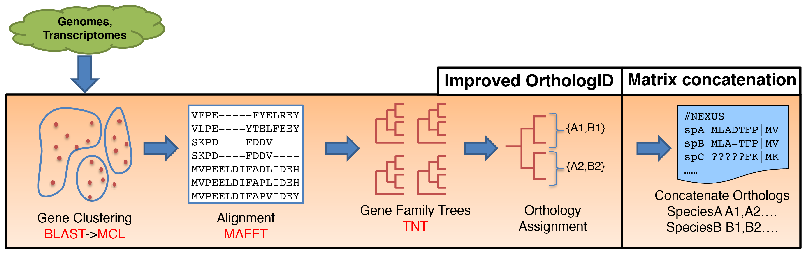

# PhyloGeneious
[Click here for the latest version! -> 2025 update](https://github.com/coruzzilab/PhyloGeneious/tree/2025_update) 

High Performance Computing optimized orthology inference.

PhyloGeneious is an improved version of the OrthologID pipeline, optimized for HPC clusters (Works on Slurm and PBS job schedulers).

### Dependencies:
The pipeline uses various programs to complete the analysis. Please make sure to install the following programs and add them to your $PATH variable:
1.  BLAST+
2.  MCL
3.  MAFFT
4.  TNT	# Before running the pipeline for the first time, type "tnt", and agree to the terms and conditions
6.  Perl > v.5.20	# Needs the DB_File.pm module

### Run setup:
1. Create a project folder
2. Copy the "procfiles.txt" and "config" files from the provided testdata folder to your project folder.
   - The "config" file contains important instructions to run the pipeline (see instructions below).
   - The "procfiles.txt" contains instructions for building the gene family trees with TNT.

3. Create a "blastdb" subfolder in your project folder. This folder should include all the protein sequences (a fasta file) for each of the included species (see instructions below)

#### Input protein fasta files:
- Give a simple and short name for each of the included species. We usually take the first 3 letters from the genus and species names (e.g. "Aratha" for "Arabidopsis thaliana").
- The input fasta file name should be the species short name + ".faa", e.g. Aratha.faa.
- Each sequence header in the faa file should start with the species short name + "#" + sequence id, e.g. ">Aratha#AT1G50030"
- Make sure there are no special characters in the sequence headers (e.g. "@","-") or in the peptid sequences (e.g. "*" stop codons).

#### config file:
1. Required arguments:
- INGROUP= 	List of species short names for the ingroup taxa, separated by spaces.
- OUTGROUP= 	At least one species short name for an outgroup taxon (multiple outgroup taxa should be space-separated)
- HPC=  		S (slurm) or P (pbs) - which job scheduling system is supported by the HPC system.
2. Not required but recommended:
- NCPU=  		Number of cpus to ask for starting a BLAST or TNT type job.
- MAXQS= 		Number of process to run simultaneously - nominally BLAST and TNT jobs.
- TNTA=  		Lowest family size to be pooled in a group job running TNT.
- TNTB=  		Family size requiring a stand-alone process to run TNT.
- BLSTMIN=  	Number of minutes for an average BLAST job to run.

#### Environment variables:
- Use the "$OID_HOME" and "$OID_USER_DIR" environment variables to indicate the path to the PhyloGeneious folder (code) and to your project working directory, respectively (You have to do that before initiating a run):
export OID_HOME=/path/to/PhyloGeneious/folder
export OID_USER_DIR=/path/to/project/folder
- For large analyses (usually above 30 taxa), you can increase the amount of requested memory per CPU (default 2GB per CPU), using the $OID_MCL variable, e.g.:
export OID_MCL=6

#### Running command:
Once you set all the above, including the environment variables, type the following command to start the analysis:

nohup sh $OID_HOME/bin/topshell.sh > run.log 2>&1 &

#### Some notes:
- A log of the main job is saved in the "toplog" subfolder
- The pipeline is set to cancels it self every 20 hr, and restart automatically. This is because often jobs on HPC have a walltime limit. In the furue we will allow to costumize this variable
- It creates ".done" files, so that if a job crashes, it picks up where it left (just restart the run again, don't forget the environment variables...)
- The "data" subfolder will contain:
  - Gene family subfolder (numbered from 1, which is the largest family, till family X).
    - "FAMILY" file: fasta file containing all the gene family sequences
    - "FAMILY.aligned" file: fasta file containing the MAFFT alignment for all gene family sequences
    - "oid.tre" file: gene family tree file in a newick format
    - "orthologs" file: each line containing the sequence ids for an identifed ortholog group
    - all other files are less important...
  - Gene families with less than 4 sequences (those will start with "S" followed by a number) - these will not be further processed (alignment, tree search, and orthlog calling), and therefore not be included in the concatenated matrix, as they have too few sequences for tree search.
  - a "singlets" file, containing all the sequences that were not clustered into gene families using MCL.

#### Outputs:
The pipeline will identify the ortholog groups and create concatenated matrices and partition files:
1. Matrix.nex - Concatenated matrix in a nexus format for searching a total evidence (species) tree using POUP
2. Matrix.phy - Concatenated matrix in a PHYLIP format for searching a total evidence (species) tree using RAxML or IQTREE
4. Matrix.tnt - Concatenated matrix in a TNT expected format for searching a total evidence (species) tree using TNT. It includes only parsimony informative characters to save space/memory
5. partitions.txt - Partition (= ortholog groups) coordinates on the Matrix.phy for RAxML (if running with a partition file)
6. partitionMembers.txt - Partition sequence identifiers (of all the taxa member) and the familyID from where the partition/ortholog group was identified.
7. MatrixRecoding.log - a log file that indicate which partitions (= ortholog groups) were filtered out from the Matrix.tnt for having 0 informative characters.

These output files can be recreated if some modifications are required using the PhyloGeneious/bin/orth2matrix.pl script (note that it usually requires a lot of memory, so run it on a high memory node. Usually ≥128GB, or even 250GB, depends of the size of the data set), e.g.:

export OID_HOME=/path/to/PhyloGeneious/folder

export OID_USER_DIR=/path/to/project/folder

\# "-m" for setting a minmum cutoff for number of taxa per ortholog group, for that ortholog group to be included in concatenated matrix:

perl $OID_HOME/bin/orth2matrix.pl -m 10

\# "-x" to exclude a given taxa from the concatenated matrix (for tree search). Multiple taxa can be indicated (comma-seperated):

perl $OID_HOME/bin/orth2matrix.pl -x Aratha

\# "-O" flag will remove all partitions that do not contain a sequence from the outgroup:

perl $OID_HOME/bin/orth2matrix.pl -O

### Troubleshooting:

A. Data entry issues: Issues with data correctness and completeness can cause the pipeline to fail in certain cases. Here are some common issues:

1. Protein sequence files have to be in FASTA format and need to have a name that ends in .faa The pipeline does not recognize files that have a different name such as .fas OR .fasta

2. The species short name (e.g., SPECIES1) has to be identical in all three places: 1. config file where INGROUP and OUTGROUP are specified. 2. File name for fasta file (SPECIES1.faa) and 3. sequence headers in Fasta file (e.g., >SPECIES1#xxxxx) 

B. Pipeline customization: Compute clusters come in all sizes and configurations, with key differences in job management software, walltime limits, memory limits etc. It's impossible to have the pipeline auto-adjust to all these settings. So, please make sure the pipeline is customized for your cluster by doing the following:

1. Provide a template job submission script in $OID_HOME/bin/ For clusters using SLURM job management, name this file pipe.slu and if cluster uses PBS, name the file pipe.pbs In either case, this file should include all the arguments typically provided to the job manager. Example scripts are provided in the distribution and should be edited to fit your cluster.

2. In the file $OID_HOME/bin/run_pipeline.sh the very first non-comment line defines the name of the queue available to you for job submissions. Please edit this line to provide the correct queue name.

C. Failure modes: The PhyloGeneious pipeline uses an array of software tools in multiple stages. With certain input data sets, especially those that are very large, some of the steps will fail due to resource limitations or other unavoidable issues. 

1. After the gene families are reconstructed some of the largest gene families may be very large (> 1000 proteins). These large families need an extraordinary amount of compute resources, i.e., memory and walltime, to be phylogenetically resolved. If the ortholog resolution in a gene family keeps failing for any reason, you can skip the family by creating an empty oid.tre file in that family folder (e.g., for family 25 `touch $OID_USER_DIR/data/25/oid.tre`)

### Disclamer:
- This pipeline is under development and only been tested and used on New York University's HPC cluster (Slurm and PBS job schedulers). While it is likely to work on PBS or Slurm HPC systems, it is not guaranteed.

